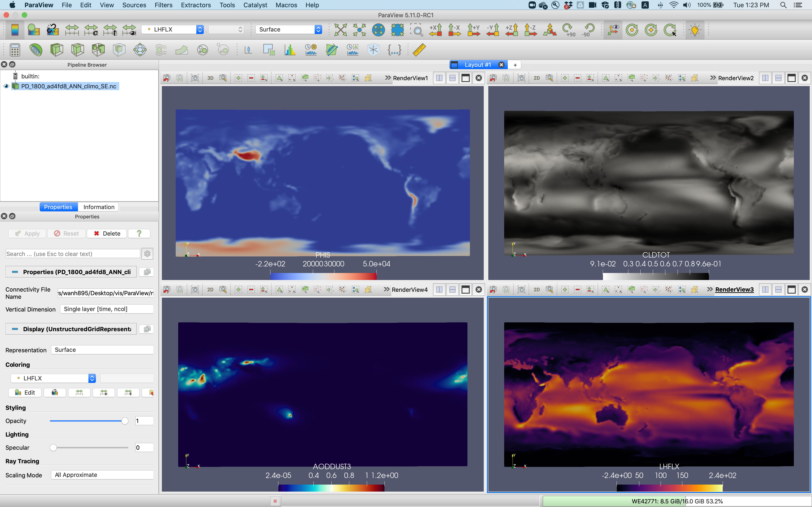
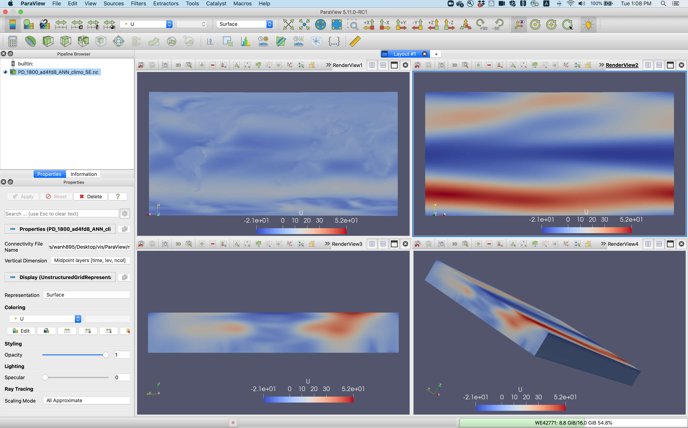

* When: 2022-09-19, 11:30am PT, 2:30pm ET
* Who: Hui, Berk, Chris, Brianna
* Topic: Using ParaView on EAM output

## Meeting notes

* Bugfix for the ParaView crashes described in the pre-meeting notes below will be included in a new release candidate.
* Chris converted ParaView traces (see the pre-meeting notes below) to simple trame apps.
* Hui expressed the wish to have some enhancements in ParaView for displaying the z coordinate in the EAM output:
  *  Instead of using layer indices, use the 1D variable `lev` as the vertical coordinate for the variables defined on midpoint layer and use `ilev` for the variables defined on interface layers.
  *  The values of `lev` and `ilev` are the so-called norminal (air) pressure given in the unit of hPa. A typical range is [0, 1000]. It would be useful to have the options to show the vertical coordinate in either linear or logarithmic scale.
  *  It would be helpful to change the aspect ratio when rendering the vertical coordinate so that an y-z cross-section has an aspect ratio close to 1:1.
 
* Hui will provide examples showing how to remap EAM's output from the cubed sphere mesh to a latitude-longitude (lat-lon) mesh.

## Pre-meeting notes

### Hui's notes from 9/13/2022

* I uploaded a new sample output file `PD_1800_ad4fd8_ANN_climo_SE.nc` to [the directory](https://compy-dtn.pnl.gov/wanh895/ParaView_EAM/cubed_sphere/model_output_samples/). This file has more typical meteorological fields (like winds, temperature, clouds, aerosol-related quantities). Also, the values are annual averages, which can help us orient ourselves.
* I downloaded ParaView 5.11.0-RC1 to my MacBook Pro (OS is 10.15.7, Catalina) and used it on the new sample data. See the two screenshots below.

#### Loading the data file in ParaView

* After selecting `PD_1800_ad4fd8_ANN_climo_SE.nc` in the "Open File" dialogue, ParaView will pop up a window asking which reader to use. Choose `NetCDF CAM Reader`.
* Very important: before hitting the `Apply` button in the `Properties` panel, find the box with the text `Connectivity File Name` to its left, click on the button with `...` to the right of the box to specify the connectivity file.
* After specifying the connectivity file, click on the `Apply` button.

#### Selecting fields to display

* In the `Properties` panel, under `Coloring`, there is a box with the text `Solid Color`. The list of fields/variables in the loaded data file is hidden in that button.
* To change from, say, the group of variables defined at layer midpoints to the group of variables defined at the Earth's surface, go to the "Properties" panel and use the button to the right of `Vertical Dimension`.
* After making your choice using that button, remember to hit the `Apply` button in the `Properties` panel! Otherwise, the field list won't update.

#### 2D fields dislayed in ParaView

Python script generated by the Trace tool: [PD_1800_ad4fd8_ANN_climo_SE_show_single_layer_fields.py](vis-meeting-2022-09-19_files/PD_1800_ad4fd8_ANN_climo_SE_show_single_layer_fields.py). _Note: Lines containing "AdditionalLights = None" in the original script have been removed by Chris (thank you Chris). Otherwise they would cause ParaView to crash._

#### A 3D field dislayed in ParaView

Python script generated by the Trace tool: [PD_1800_ad4fd8_ANN_climo_SE_show_3D_field.py](vis-meeting-2022-09-19_files/PD_1800_ad4fd8_ANN_climo_SE_show_3D_field.py). _Note: Lines containing "AdditionalLights = None" in the original script have been removed by Chris (thank you Chris). Otherwise they would cause ParaView to crash._

 
