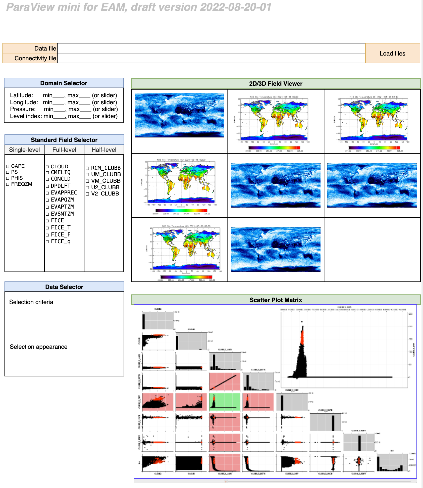

* When: 2022-08-29, 11:30am PT, 2:30pm ET
* Who: Berk Geveci, Brianna Major, Chris Harris, Hui Wan
* Topic: mini ParaView GUI for EAM

# Thoughts from Hui

I would love to use ParaView for interactive, exploratory analysis of EAM output, and I imagine ParaView will become increasingly more helpful as the model's resolution increases. 

The challenges I encountered a few years back were:

* ParaView's many capabilities, buttons and menus can be daunting for new users.
* To use the CAM reader to load a CAM or EAM output file, we need to click several buttons in a specific sequence, which is cumbersome and error-prone.
* For 3D views, the CAM reader doesn't seem to know we want to revert the vertical coordinate (lev or ilev) by default, and there is no global map or coastline displaced, so it can be a bit hard to orient ourselves.

Based on this experience, I suggest that we create an EAM-specific UI. Below I've posted a first draft of a layout we could consider. 

## Test data

* Connectivity file: [download from here](https://compy-dtn.pnl.gov/wanh895/ParaView_EAM/cubed_sphere/connectivity_files/)
* EAM output file (NetCDF): [download from here](https://compy-dtn.pnl.gov/wanh895/ParaView_EAM/cubed_sphere/model_output_samples/)

## Map projections

Please see examples from theh NCAR Command Language at [https://www.ncl.ucar.edu/Document/Graphics/map_projections.shtml](https://www.ncl.ucar.edu/Document/Graphics/map_projections.shtml)

To start with, we could focus on the [cylindrical equidistant projection](https://www.ncl.ucar.edu/Document/Graphics/Images/ncl_map_projections.cylindricalequidistant.png)

## Intital draft for the GUI layout

----

# Next meeting: Sept. 12, 2022
